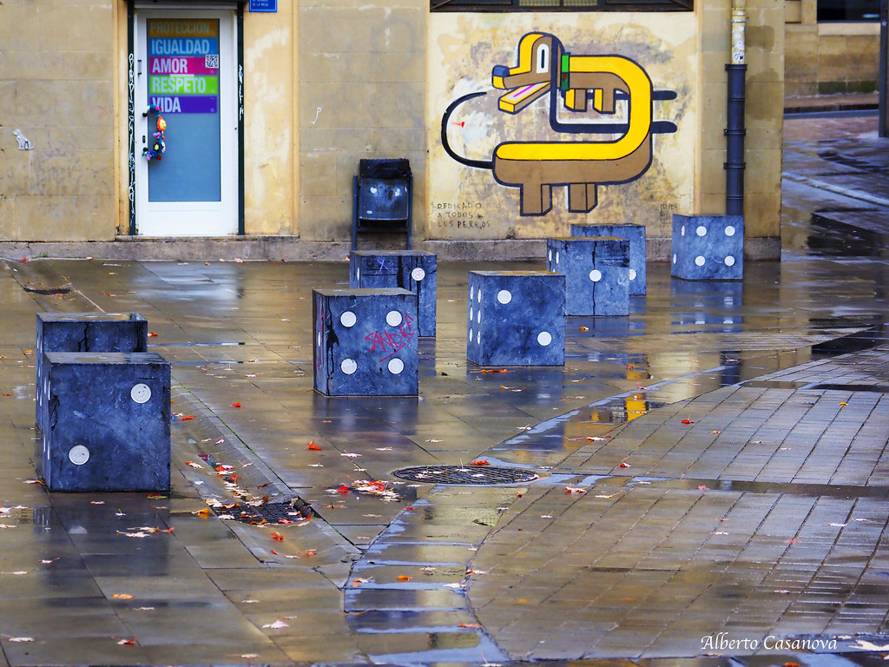

# ELS NOSTRES APUNTS

En aquesta web podeu consultar tot el material que utilitzarem per a desenvolupar la unitat 1 , que aquest curs es correspon amb la unitat d'atzar i probabilitat del temari de segon de batxillerat de les matemàtiques aplicades a les ciències socials.

# Índex de la unitat  
- **Tipus de successos.Successos Probabilístics.**
- **Àlgebra de Boole**
- **Espai probabilístic.**
- **Càlcul de la probabilitat.Definicions de probabilitat**.
- **Probabilitat condicionada.Successos independents. Regla del producte.**
- **Teoremes. Regla de la suma.**
# Curiositats
# Altres webs d'interés
# Llibres de consulta
# Pel·lícules i documentals relacionats amb la probabilitat
# Web del projecte
# Altres recursos didàctics
# Llicència

