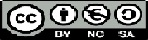

<html lang="en">
<head>
<meta charset="UTF-8">
<meta http-equiv="X-UA-Compatible" content="IE=edge">
<meta name="viewport" content="width=device-width, initial-scale=1.0">
<title>
Les matemàtiques mouen el món
</title>
<link rel="stylesheet" href="llicència.css">
</head>
<body>
<header>
<h1>Les xarxes socials conecten el món</h1>
<section>

        <a href="https://twitter.com/cedec_intef">Twitter</a>
        <a href="https://www.facebook.com/cedec.intef">Facebook</a>
        <a href="https://www.youtube.com/channel/UCb3Zc8dSBfvEVzbrIFo9ACA">Youtube</a>
        <a href="https://www.instagram.com/">Instagram</a>
     

</section>
</header>
</body>
</html>

Copyright   
