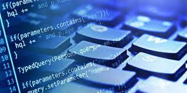
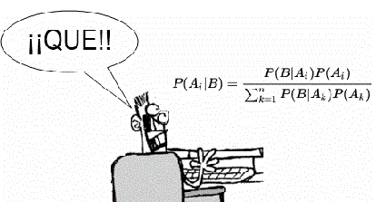

# PROGRAMARI ESTADÍSTIC
L'ús d'ordinadors i calculadores facilita el que els alumnes comprenguen millor temes complexos de matemàtiques. És evident que en molts casos la tecnologia agilitza i supera, la capacitat de càlcul de la ment humana, amb ajuda de la tecnologia, els alumnes tenen més temps per a concentrar-se a enriquir el seu aprenentatge matemàtic.

Les noves tecnologies han vingut a canviar per complet el panorama tradicional de com es feien, es veien i s'ensenyaven les matemàtiques. Introduir-se en aquest nou panorama implica fer profunds canvis en els nostres programes educatius.

És molt àmplia la varietat d'aplicacions informàtiques disponibles per a estadística i probabilitat:

- Excel o Calc
- JavaScript
- Miniaplicació de Java, Geogebra
- Projecte Descartes
- Software Lliure
- Altre Programari

### Excel/Calc
El full de càlcul Excel o *Calc (OpenOffice) és un programari considerat com a estàndard en tots els entorns(educatiu, professional, familiar, etc), que posseeix la virtut de presentar una interfície agradable, una facilitat d'ús digna d'elogi i permet realitzar anàlisis estadístiques simples o més complexos i avançats.

### JavaScript
JavaScript, és un llenguatge de programació de pàgines web de costat del client, ens permet afegir a les pàgines web efectes i funcions addicionals als contemplats en l'estàndard HTML. Gràcies a que s'executa en el navegador(localment), JavaScript, ens permet respondre de manera ràpida i eficaç a les accions de l'usuari, creant d'aquesta manera aplicacions interactives.

### Miniaplicació de Java
El llenguatge Java es pot usar per a crear les miniaplicacions de Java. Una miniaplicació és un element més d'una pàgina web, com una imatge o una porció de text. Quan el navegador carrega la pàgina web, la miniaplicació inserida en aquesta pàgina es carrega i s'executa.

### Projecte Descartes
Descartes (M.E.C.) és un programa realitzat en llenguatge miniaplicació de *java que es caracteritzen perquè creen "escenes" que es poden inserir en les pàgines web. Descartes no sols converteix una web en una web interactiva sinó que, a més, és configurable, és a dir, que els usuaris (professors) poden "programar-ho" perquè apareguen diferents elements i diferents tipus d'interacció.

### Programari Lliure
"Programari Lliure" és un assumpte de llibertat, no de preu.`Programari Lliure'' es refereix a la llibertat dels usuaris per a executar, copiar, distribuir, estudiar, canviar i millorar el programari.

### Altre programari
Destaquem per a l'entorn educatiu: SPSS, S-PLUS, MINITAB, STATGRAPHICS,..
