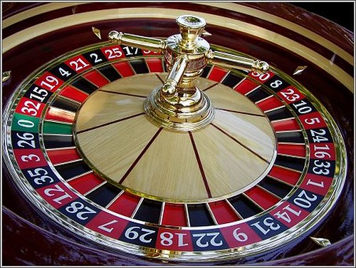

# **Càlcul de la probabilitat.Definicions de probabilitat**.

## *Probabilitat clàssica.Regla de Laplace.*

L'origen de la probabilitat va sorgir amb els jocs (cartes,daus,monedes,etc), i el seu principal protagonista va ser el matemàtic francés Pierre Laplace $_1$.  

> *“Les preguntes més importants de la vida, de fet, no són en la seua majoria més que problemes de probabilitat”*  

> ***Pierre Simon Laplace***
> 
> $_1$ Biografia [Pierre.S.Laplace](https://es.wikipedia.org/wiki/Pierre-Simon_Laplace)  
> 
> **La regla de Laplace.**  

- **Instruments irregulars** : Daus trucats, una xinxeta... Per a avaluar la probabilitat d'aquests
successos es recorre a la llei dels grans números. P(S) = *fr(S). Com més gran siga la N més fiable serà l'estimació.  
- Instruments regulars, però **successos elementals no equiprobables**:Per exemple llancem dos daus correctes i sumem els seus resultats. Per a calcular la seua probabilitat recorrem a tècniques de recompte i modifiquem la descripció de l'experiència de manera que els successos elementals siguen equiprobables.

Extraiem una carta d'una baralla de 40 cartes com la de la figura 7 :Calculem P(bastos), P(as) i P(as de bastos).

**Figura 7**: Baralla espanyola.  

**P(bastos)=$\frac{10}{40}$**=**$\frac{1}{4}$=0,25**

**P(as)=$\frac{4}{40}$**=**$\frac{1}{10}$=0,10**

**P(as de bastos)=$\frac{1}{40}$=0,025**

### **ACTIVITATS DE LA REGLA DE LAPLACE**

1. En l’experiment aleatori «extreure una carta d’una
   baralla de 48 cartes», calcula la probabilitat dels successos següents:a)Treure una carta que sigui un nombre primer.b)Que la carta que extraiem no sigui un as.c)Que sigui una figura d’espases.d)Treure una carta de copes.
2. D’una classe on hi ha 20 noies i 15 nois escollim dos
   alumnes a l’atzar.Calcula la probabilitat que:a) Siguin dues noies.b) Siguin un noi i una noia.c) Entre els escollits hi hagi un alumne o una alumna
   determinats.
3. Calcula la probabilitat que quan girem una fitxa de
   dòmino(consta de 28 fitxes) s’obtingui:a) Un nombre de punts més gran que 8.b) Un nombre de punts que sigui múltiple de 3.c) Una fitxa doble.d) Una fitxa en què la suma dels punts sigui 7.
4. Llancem dos daus enlaire. Calcula la probabilitat
   d’obtenir:a) Suma de punts igual a 10.b) Suma de punts senars.c) Almenys un 6 en un dels daus.d) Només un 6 en un dau.
5. Es tira una moneda enlaire quatre vegades.
   a) Quina és la probabilitat que surtin 4 cares?
   b) I que surtin 2 cares i 2 creus?
   c) I almenys 2 creus?

## *Probabilitat Experimental. Llei dels grans nombres.*

>  Nota recordatòria de coneixements previs

**FREQÜÈNCIA ABSOLUTA I FREQÜÈNCIA RELATIVA**

Realitzem N vegades una experiència aleatòria.Es diu **freqüència absoluta** d'un succés **S**,o simplement,freqüència de **S**, al nombre de vegades que ocorre **S**. Es designa per **f(S)**.
Es diu **freqüència relativa** d'un succés **S** a la proporció de vegades que ocorre **S**.
Es designa per  **fr(S) = $\frac{f(S)}{N}$**

Introduirem el concepte de probabilitat a partir d'un **exemple concret**.En una atracció de fira es tracta d'**apostar en una ruleta**, que veiem avall. Cal girar la fletxa i endevinar el número que assenyalarà.
L'espai mostral és ben simple: E={1 ,2 ,3}.
Només hi ha tres successos elementals:  

**Figura 8: Ruleta**

> **S1=“ix el 1” ;  S2 =“ix el 2” ;  S3 =“ix el 3”**.  
La probabilitat d'un succés és un número que tracta de mesurar la versemblança de la seua ocurrència.Intentarem assignar-ho a través d'aquestes qüestions:  
a) Si apostares per l'aparició d'un número, per quin ho faries?  
b) Et sembla que el 2 i el 3 tenen igual probabilitat d'aparéixer? I l'1 i el 2?  
c) Quina relació et sembla que han de guardar les probabilitats de S1 i de S2? I quina relació han de
guardar les de S2 i S3?  
d) Et sembla adequada l'assignació de “probabilitats” següent?  
 > S1 $\to$ 50%   S2 $\to$ 25%   S3 $\to$ 25%  
e) S'han realitzat tres proves i s'ha obtingut la sèrie 2, 3, 2. Et sembla estrany?
f) S'han realitzat mil proves i s'ha obtingut:
 > 1 ha aparegut 3 vegades.
 > 2 ha aparegut 167 vegades.
 > 3 ha aparegut 830 vegades.
Què et sembla ara?
Hem de tindre clar que donar la probabilitat d'un succés és assignar-li un número que informa sobre la freqüència amb què s'espera que es presente en una sèrie elevada de repeticions de l'esperiència aleatòria.
Per a això s'introdueix el següent concepte:

| Si un exp. aleatori es repeteix N vegades i un succés A se es repeteix N vegades i un succés A se  verifica en n(A) d'ells, es diu freqüència relativa d'A  el número f(A)=$\frac{n(A)}{N}$ |
| -------------------------------------------------------------------------------------------------------------------------------------------------------------------------------------------------------------------------------------------------------- |

S'ha simulat amb ordinador mil vegades la realització de l'experiència aleatòria anterior, sense paranys, obtenint els següents resultats:  

 
**Figura 9: Gràfic experimental**  

Observem com les freqüències relatives de cadascun dels successos s'estabilitzen cap a uns certs valors:  aqueixos valors són els que es denominen probabilitats.  
En el nostre cas, és d'esperar que en una “sèrie il·limitada”:  
S1 aparega en el 50% de les ocasions. **P(S$_1$) = $\frac{1}{2}=0,5$**

S2 aparega en el 25% de les ocasions. **P(S$_1$) = $\frac{1}{4}=0,25$**

S3 aparega en el 25% de les ocasions. **P(S$_1$) = $\frac{1}{4}=0,25$**

Passem a l'anomenada **"definició clàssica"** de la probabilitat:

> Considerem un exp. aleatori que es repeteix N vegades.
> Quan N$\to$ $\infty$ es té que la freqüència relativa de cada succés A **“s'estabilitza”** entorn d'un cert valor **P(A)**, que anomenarem probabilitat del succés. Aquesta és la definició de la LLei dels grans nombres que va enunciar per primera vegada el matemàtic [Jacob Bernoulli](https://es.wikipedia.org/wiki/Jakob_Bernoulli).

Exemple: He simulat amb un ordinador el llançament d'una moneda 100.000 vegades, i he obtingut:

fr(cara)=$\frac{49.968}{100.000}$=0'49968
fr(creu)=$\frac{52.032}{100.000}$=0'5003

Com veiem, corrobora la idea d'assignar un 50% de possibilitats a cadascun dels successos elementals.

> (Per a simular una experiència així és suficient un ordinador personal que tinga instal·lada un full de càlcul.La funció que s'usa és “random” o “generació de números aleatoris”. Anima't i fes-ho.

## *Probabilitat subjectiva o teòrica.*

**Teoria subjectivista**. Proposta per primera vegada per [F.P. Ramsey](https://es.wikipedia.org/wiki/Frank_P._Ramsey), en The Foundations of Mathematics and other Logical Essays [Fonamentació de les matemàtiques i altres assajos de lògica] de 1931. És el grau de [versemblança](https://www.wikisofia.cat/wiki/Versemblan%C3%A7a) que atribuïm a un enunciat o, en expressió de [Carnap](https://www.wikisofia.cat/wiki/Autor:Carnap,_Rudolf), «el grau de certesa o confiança que poden tenir les nostres creences sobre successos futurs». Encara que així entesa, la probabilitat sembla ser més aviat un estat d'ànim subjectiu, també pot expressar-se mitjançant un valor numèric, o sigui, quantitativament i, en aquest cas, la probabilitat és una mesura de la possibilitat d'un esdeveniment que expressem mitjançant un nombre. Segons aquesta teoria, la probabilitat expressa només un sentiment subjectiu de certitud d'un subjecte davant la possibilitat que ocorri un succés determinat.  

 
**Figura 10: Ramsey**  

## *Probabilitat axiomàtica.*

La **teoria axiomàtica**, exposada per [A.N. Kolmogorv](https://es.wikipedia.org/wiki/Andr%C3%A9i_Kolmog%C3%B3rov), en Fonaments de la teoria de la probabilitat (1933), és la manera actual de calcular la probabilitat.
És una teoria purament formal, que utilitza axiomes i teoremes, i integra la matemàtica de la probabilitat amb la teoria de conjunts.  

 
**Figura 11: Kolmogorov**  

***PROPIETATS DE LES PROBABILITATS.***  

**Axiomàtiques**: Inspirades en les pròpies de la freqüència relativa. Les propietats de cada succés és un número. S'han de complir els següents ### **axiomes**:

- Ax.1 : Qualsevol que siga el succés S, P(S)$\succeq$ 0
- Ax.2 : Si dos successos són incompatibles, la probabilitat de la seua unió és igual a la suma de les seues probabilitats.  
  A$\cap$B=$\phi$$\to$   P (A$\cup$B)=P(A)+P(B)
- Ax.3 : La probabilitat total és 1:P(E)=1
  En essència, aquestes tres propietats indiquen que disposem d'una quantitat total de probabilitat
  igual a 1 que hem de repartir additivament entre els diferents successos.**Teoremes**: Es dedueixen de les propietats axiomàtiques:
- T.1 : P(A$^c$)=1 – P(A)
- T.2 : P($\phi$)= 0
- T.3 : Si A$\subset$ B, llavors P(B)=P(A)+P(B-A)
- T.4 : Si A$\subset$ B, llavors P(A)$\leq$P(B)
- T.5 : Si A$_1$, A$_2$, ....,A$_k$ són incompatibles dos a dos, llavors:
  P(A$_1$ $\cup$ A$_2$ $\cup$ .... $\cup$A$_k$) = P(A$_1$) + P(A$_2$) + .... + P(A$_k$)
- T.6 : P(A$\cup$B)=P(A)+P(B) – P(A∩B)
- T.7 : Si l'espai mostral E és finit i un succés és S = {x$_1$, x$_2$, ...., x$_k$}, llavors:P(S)=P(x$_1$)+P(x$_2$)+....+P(x$_k$)

**Exemple 1**: Coneixem les següents probabilitats: P(A)=0,4; P(B)=0,7; P(A$^c$$\cup$B$^c$)=0,2. Calcula P(A$\cap$B)$^c$ ; P(A$\cap$B) i P(A$\cup$B).

> Solució: P(A$^c$$\cup$B$^c$)=0,2 Lleis de Morgan
> =P(A$\cap$B)$^c$ $\rightarrow$ P(A$\cap$B)=1– 0,2=0,8
> P(A$\cap$B)$^c$= 0,2 i P(A$\cap$B) = 0,8 ; P(A$\cup$B)=P(A)+P(B)–P(A$\cap$B) $\rightarrow$ P(A$\cup$B)=0,4+0,7– 0,8=0,3
>

**Exemple 2**: Sabem que: P(M$\cup$N)=0,6; P(M$\cap$N)=0,1;P(M$^c$)=0,7 .Calcula P(M) i P(N).

> Solució:
> P(M)=1– P(M$^c$)=1 – 0,7= 0,3
> P(M$\cup$N)=P(M) + P(N) – P(M$\cap$N)$\rightarrow$
> 0,6=0,3+P(N) – 0,1 $\rightarrow$  P(N)=0,6 – 0,3 + 0,1=0,4
>

### **ACTIVITATS D'APLICACIÓ DE LES PROPIETATS DE PROBABILITAT**

1. En una baralla hem suprimit diverses cartes. Entre les quals queden, es donen les següents probabilitats de ser extretes: P(Rei)=0,15 P(Bast)=0,3 P(ni Rei ni Bast)=0,6.  
   a) Està entre elles el rei de bastos? En cas afirmatiu, dona la seua probabilitat.b) Quantes cartes hi ha?   
   
3. Llancem un dau “potiner” mil vegades. Obtenim f(1) =117,f(2)=302, f(3)=38,f(4)=234,f(5)=196,f(6)=113.Estima les probabilitats de les diferents cares.Quines són les probabilitats dels successos parell, menor que 6 i {1,2}.  

4. Quina és la probabilitat d'obtindre 12 en  multiplicar els resultats de dos daus correctes?

5. Quina és la probabilitat que en llançar dos daus correctes la diferència de les seues puntuacions siga 2?

6. Tenim un dau de 20 cares{1,2,2,3,3,3,4,4,4,4,5,5,5,5,5,6,6,6,6,6} perfectament equilibrat.Quina és la probabilitat d'obtindre cada un dels resultats possibles?

7. Per al dau {1,1,2,2,2,3,3,3,3,4,4,4,4,4,5,5,5,5,5,5} de 20 cares calculeu les probabilitats següents:  
   a)P(parell)  
   b)P(més gran de 3)  
   c)P(parell i més gran de 3)  
   d)P(parell o més gran de 3)  
   e)P(parell menys més gran de 3)  
   f)P(més gran de 3 menys parell)

9. En una bossa tenim 7 boles roges, 9 boles blaves i 4 de verdes. Extraiem una bola, calculeu la probabilitat que:  
   a)No siga roja.  b) Siga verda    c) Siga roja o blava

10. En un grup, el 40% juga a bàsquet i el 60% a futbol. Si sabem que el 85% practica algun dels dos esports, quin percentatge juga a tots dos?

11. En el grup A hi ha 18 persones, de les quals 10 parlen anglés i 8 no; en el B hi ha 12 persones, de les quals 3 parlen anglés i 9 no; en el C hi ha 10 persones, entre les quals 3 parlen anglés i 7 no. Es tria a l'atzar una persona de cada grup. Calculeu la probabilitat que de les tres, almenys una parle anglés.