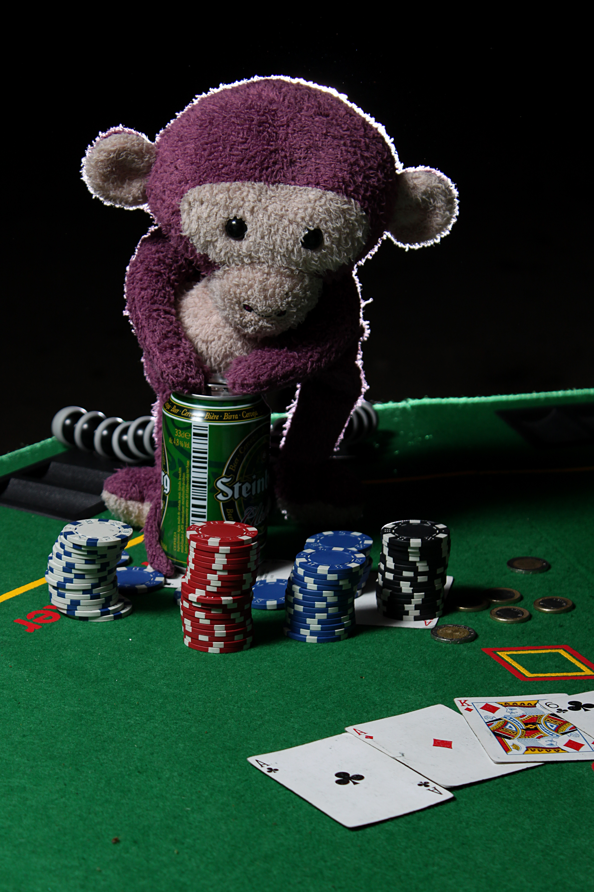

1. [EDAD](http://recursostic.educacion.es/descartes/web/materiales_didacticos/EDAD_4eso_B_val_probabilidad/index_quincena12.htm)
2. [IES LA ROCA](https://sites.google.com/a/ieslaroca.cat/jocs-i-probabilitat)
3. [MESTRE A CASA](https://mestreacasa.gva.es/web/mey_jes/184)
4. [WEBNODE](https://cmsantjaume.webnode.page/matem%C3%A0tiques/matem%C3%A0tiques%203r/taller/)

